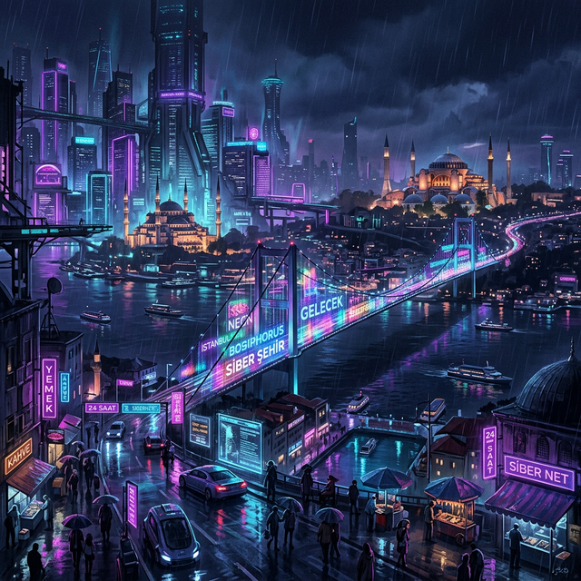

# MuseAI – Creative Engine 🎭✨

> A premium creative writing dashboard for building story universes, crafting characters, and tracking narrative quests — with AI-powered story assistance.



---

## 🌟 Features

| Feature | Description |
|---------|-------------|
| 🌍 **The World Hub** | Manage and explore your story universes with genre tags, stats, and visual cards |
| ⚔️ **Character Forge** | Create characters with stats (Strength, Intellect, Agility, Charisma), backstory, and personality traits |
| 📜 **Quest Ledger** | Track quests, milestones, and narrative arcs with status management |
| 🤖 **Lore-Master AI (CrewAI)** | **[NEW]** Active D&D Encounter mode where a CrewAI Game Master runs a dynamic campaign and spawns NPC Sub-Agents. |

---

## 🚀 Getting Started

### Prerequisites
- A modern web browser (Chrome, Firefox, Edge, Safari)

### 1. Frontend (Universal UI)
Open `index.html` in your browser. Or use a local server:
```bash
python -m http.server 8000
```
Then visit `http://localhost:8000`.

### 2. Backend (CrewAI Engine)
Required for the "Lore-Master AI" Active Encounter tab.
```bash
# Navigate to backend
cd backend

# Setup environment
# Create .env based on .env.example and add your OPENROUTER_API_KEY

# Install dependencies
pip install -r requirements.txt

# Run API server
py api.py
```
The backend runs on `http://localhost:8000`. Ensure you use a different port for the frontend if using a local server!

---

## 🛠️ Technologies Used

| Technology | Purpose |
|-----------|---------|
| **HTML5** | Semantic page structure |
| **CSS3** | Custom properties, Grid, Flexbox, animations |
| **JavaScript (ES6+)** | Modular SPA architecture with IIFE pattern |
| **LocalStorage** | Client-side data persistence |
| **Google Fonts** | Inter & Rajdhani typography |

---

## 🏗️ Architecture

---

## 🏗️ Architecture

The application follows a **modular architecture** with clear separation of concerns, connecting a robust Vanilla JS frontend to a Python-based CrewAI microservice backend.

### Frontend Domain (Vanilla JS)
```text
app.js
├── DataStore      → Single source of truth, CRUD operations, localStorage persistence
├── Renderer       → Pure rendering functions (data → HTML), no side effects
├── Controller     → Event handling, orchestration, business logic
├── Router         → SPA page navigation
└── ModalManager   → Centralized modal open/close/reset
```

### Backend Domain (CrewAI Two-Pass Engine)
The Lore-Master AI replaces our mock responses with a fully dynamic D&D Engine using a two-pass architecture:
1. **Pass 1 (Game Master Routing):** A CrewAI Game Master evaluates the player's action, checks stats (strength, intellect, etc.) from Homework 2 databases, and generates a structured Pydantic layout of the story.
2. **Pass 2 (Dynamic NPC Sub-Agents):** If the GM determines an NPC should react, a dynamically instantiated CrewAI agent is spawned on-the-fly, given a strict persona, and converses distinctly from the global narrator.

---

## 📁 Project Structure

```
MuseAI/
├── index.html              # Main SPA entry point
├── style.css               # Complete design system
├── app.js                  # Application logic (modular)
├── README.md               # This file
├── Planning_Document.md    # AI Agent integration plan
└── assets/
    └── images/
        ├── universes/      # Universe card images
        └── characters/     # Character portrait images
```

---

## 📋 AI Agent Planning Document

The detailed AI integration plan is available in [Planning_Document.md](Planning_Document.md).

**Key Concept:** The **LORE-MASTER ENGINE** is a Narrative Consultant & Consistency Evaluator that:
- Analyzes character traits against proposed story actions
- Detects potential plot holes and inconsistencies
- Suggests creative alternatives based on character profiles

---

## 🎨 Design

- **Theme**: Dark purple/neon aesthetic inspired by cyberpunk and fantasy RPG interfaces
- **Typography**: Inter (body), Rajdhani (headings)
- **Colors**: Deep dark backgrounds with purple (#7c3aed) and pink (#ec4899) accents
- **Animations**: Smooth transitions, slide-up effects, and subtle micro-interactions

---

## 📄 License

This project is created for educational purposes as part of a university assignment.

---

## 👤 Author

**Mert Kedik** — Story Architect & Developer
